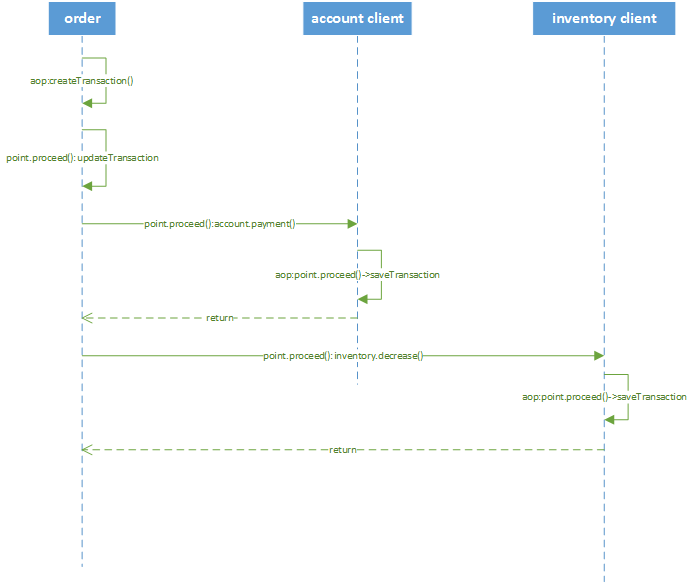

# 分布式事务框架microservice-transaction

## 项目结构
- tcc-admin（事务管理后台）
- tcc-annotation（分布式事务注解）
- tcc-core（分布式事务框架核心包）
- tcc-demo（经典订单，账户，库存demo体验）
- tcc-springcloud（springcloud用户支持）
- ......

## 特性
 （1）支持嵌套事务(Nested transaction support)

 （2）采用disruptor进行事务日志的异步读写，异步confirm和cancel（disruptor是一个无锁，无GC的并发编程框架）

 （3）支持SpringBoot-starter 项目启动

 （4）本地事务存储支持 : redis,mongodb,mysql，推荐使用monodb

 （5）采用Aspect AOP 切面思想与Spring无缝集成，天然支持集群，事务注解对业务代码无侵入式，完全可插拔


### 序列图

以经典demo订单，账户，库存为例
-----------------


## tcc-demo体验

### 初始化
- 导入业务数据库，tcc-demo/sql/tcc-demo.sql
- 下载代码 git@gitlab.leucs.com:yl1997/microservice-transaction.git

### 修改配置application.yml

### 业务数据库配置
```
spring:
    datasource:
        driver-class-name:  com.mysql.jdbc.Driver
        url: jdbc:mysql://127.0.0.1:3306/tcc_order?useUnicode=true&characterEncoding=utf8
        username: root
        password: root
    application:
      name: order-service
```

### 全局tccConfig配置
```
tcc.config:
    connectTimeoutMillis: 1200000
    readTimeoutMillis: 1200000
    serializer: kryo
    recoverDelayTime: 60
    retryMax: 3
    scheduledDelay: 70
    scheduledThreadMax: 4
    repositorySupport: mongodb
    tccMongoConfig:
        mongoDbUrl: 127.0.0.1:27017
        mongoDbName : tcc
        mongoUserName : tcc
        mongoUserPwd : tcc
```
### FeignClient配置
connectTimeoutMillis，readTimeoutMillis为feign client的超时时间设置，用于模拟RPC调用异常

### 事务回滚补偿配置
    recoverDelayTime 补偿延迟时间（不需要改）

    retryMax 最大重试次数（不需要改）

    scheduledDelay 定时任务执行间隔

### 事务日志存储配置
  （1） repositorySupport 事务日志存储支持（db,redis,mongo,zookeeper）,默认为db
  （2）tccDbConfig 为db类型配置
  （3）tccRedisConfig 为redis配置
  （4）tccMongoConfig 为mongodb配置
  （5）......

## 启动项目
- 先启动EurekaServerApplication（服务注册中心）

- 启动SpringCloudTccOrderApplication，SpringCloudTccAccountApplication，SpringCloudTccInventoryApplication（不分先后）
