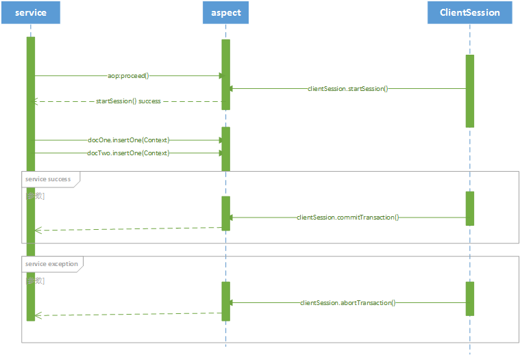

# MongoDB多文档事务方案设计

## 前言
在早期的MongoDB版本中，仅支持单文档事务，如果想使用多文档事务，需要依赖特别的数据建模才能够保证。而在MongoDB 4.0中，无论您如何为数据建模，都能够支持多文档事务。

## 需求
亿联YMS2.x,CLOUD2.x目前采用的是MongoDB集群作为业务存储引擎，MongoDB目前仅支持单文档事务（即关系型数据库中的单表），
为了满足实际业务需求，需支持多文档事务

## 整体方案
- 升级MongoDB4.0，mongo-java-driver升级到3.8.1，ws-client需升级
- 引入ClientSession，由framework统一封装，对服务接口统一拦截（注意：对db的操作要求在service层实现）

## 概要设计

### 事务序列图

（1）调用service服务切面拦截开启MongoDB事务startSession

（2）service服务实现docOne.insertOne()，docTwo.insertOne()

（3）如果执行成功，提交事务commitTransaction()

（4）如果执行异常，回滚事务abortTransaction()

## 问题讨论
无

## 参考文档
[MongoDB4.0将支持多文档事务](http://blog.51cto.com/suifu/2091084)

[Spring整合MongoDB4.0](https://blog.csdn.net/qq_27768943/article/details/81129290)

